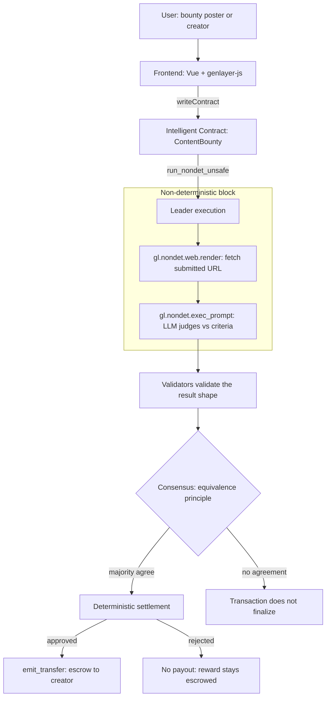

<div align="center">


# ContentBounty

**Trustless content bounties, settled by AI consensus on GenLayer.**

A bounty poster escrows a reward and writes acceptance criteria in plain English.
Anyone submits a content URL. GenLayer validators independently fetch the page,
judge it against the criteria with an LLM, reach consensus on the verdict, and the
contract releases the escrowed reward — with no trusted server, no manual approval,
and no way for any single party to fake the outcome.

[](https://explorer-studio.genlayer.com/address/0xFf546d6B1CD45d2859a705a7FA181807670B9015)
[](https://explorer-studio.genlayer.com/address/0xFf546d6B1CD45d2859a705a7FA181807670B9015)
[](LICENSE)

</div>

---

**Contents:**
[What](#1-what-is-contentbounty) ·
[Why GenLayer](#2-why-genlayer) ·
[Demo](#3-demo) ·
[Architecture](#4-architecture) ·
[Evaluation pipeline](#5-evaluation-pipeline) ·
[Consensus](#6-consensus-design) ·
[Security](#7-security) ·
[Trust model](#8-why-this-is-trustworthy) ·
[Example](#9-example-evaluation) ·
[Structure](#10-repository-structure) ·
[Local dev](#11-local-development) ·
[Future work](#12-future-work)

---

## 1. What is ContentBounty?

Content bounties are everywhere — "write a thread about our protocol," "document this API,"
"produce a tutorial." The hard part is **settlement**: deciding whether the delivered work
actually meets the criteria, and paying out fairly. Traditional bounty platforms solve this
with a **trusted intermediary** — an escrow company or the poster themselves — which means the
submitter can be stiffed, or the poster can be strung along. Pure "AI moderation" doesn't fix
it either: if a single off-chain model decides who gets paid, you've just moved the trust to
whoever runs that model and its prompt, and its output can't be verified on-chain. ContentBounty
removes the intermediary entirely: the acceptance decision is made by an **LLM running inside a
GenLayer Intelligent Contract**, replicated across independent validators who must **agree** before
the reward moves. The judgment is subjective (natural-language criteria) but the settlement is
deterministic and trustless.

## 2. Why GenLayer?

The core operation — *"fetch this URL and decide whether it satisfies this English-language
criterion"* — **cannot be done by an ordinary smart contract**. An EVM contract is deterministic
and sandboxed: it has no way to make an HTTP request, and no way to run an LLM. The usual
workarounds reintroduce trust:

- **An oracle / off-chain server** that fetches and judges, then writes the result on-chain — now
  you trust that server and its operator.
- **A DAO / manual vote** — slow, expensive, and still subjective per voter.

GenLayer's **Intelligent Contracts** are the missing primitive. They make the non-deterministic
work a **native, consensus-verified part of the transaction**:

| Requirement | GenLayer primitive |
|---|---|
| Reach the open web from inside the contract | `gl.nondet.web.render(url)` |
| Apply human-language judgment | `gl.nondet.exec_prompt(prompt)` |
| Run non-deterministic work under agreement | `gl.vm.run_nondet_unsafe(leader, validator)` |
| Multiple validators must concur | Optimistic-democracy consensus (equivalence principle) |
| Money only moves on agreement | Deterministic settlement + `emit_transfer` escrow payout |

The LLM produces a *subjective* verdict; GenLayer's validator consensus turns it into an
*objective, tamper-resistant* on-chain fact. That combination is the whole reason this project
exists on GenLayer rather than as a dApp + oracle.

## 3. Demo

<div align="center">

</div>

| | |
|---|---|
| **Repository** | https://github.com/unifyWeb3/contentbounty |
| **Intelligent Contract** | [`0xFf546d6B1CD45d2859a705a7FA181807670B9015`](https://explorer-studio.genlayer.com/address/0xFf546d6B1CD45d2859a705a7FA181807670B9015) |
| **Network** | GenLayer Studio (`studionet`, chain id `61999`) |
| **Explorer** | https://explorer-studio.genlayer.com |
| **Frontend** | Vue 3 + Vite + TypeScript + `genlayer-js` |

Run it locally in two commands — see [Local development](#11-local-development). Every evaluation
in the UI links to its transaction on the GenLayer Studio explorer, so the consensus is verifiable.

## 4. Architecture



## 5. Evaluation pipeline

What happens, step by step, when a poster clicks **Evaluate with GenLayer AI** on a submission:

1. The frontend calls `evaluate_submission(submission_id)` on the Intelligent Contract.
2. The contract loads the submission's `content_url` and the bounty's `criteria`, then enters a
   non-deterministic block via **`gl.vm.run_nondet_unsafe(get_evaluation, validate_evaluation)`**.
3. **Leader — web access:** `get_evaluation()` calls **`gl.nondet.web.render(content_url, mode="text")`**
   to fetch the page. A fetch failure is caught and returned as a structured rejection
   (`{approved: false, score: 0, feedback: "Could not load the submitted URL."}`) — never a crash.
4. **Leader — LLM reasoning:** the page text (capped) plus the criteria are passed to
   **`gl.nondet.exec_prompt(prompt, response_format="json")`**, which returns
   `{approved, score, feedback}`.
5. **Validators:** each validator runs `validate_evaluation(leader_result)`, checking the result is
   a well-formed `{approved: bool, score: 0–100, feedback: str}`. Shape validation (not exact-string
   equality) lets honest LLM wording variance still reach agreement.
6. **Consensus:** validators vote; on majority agreement the leader's verdict becomes the canonical
   result. Otherwise the transaction does not finalize.
7. **Settlement (deterministic):** the contract writes `status`, `score`, `feedback` to storage; on
   approval it marks the bounty `filled` and pays the escrowed reward to the creator via
   `emit_transfer`.

## 6. Consensus design

- **Leader** runs the non-deterministic work: one web fetch + one LLM call, producing a candidate
  verdict.
- **Validators** independently receive the leader's result and decide whether to *agree*, using
  `validate_evaluation` — a deterministic shape check on the verdict.
- **Agreement rule:** GenLayer's optimistic-democracy consensus finalizes the transaction when a
  majority of validators agree; disagreement prevents finalization rather than silently accepting a
  minority result.
- **Settlement** is ordinary deterministic contract code that runs only after agreement — storage
  writes and the escrow transfer.

Consensus matters because the judgment is subjective. A single model's answer is unverifiable and
capturable; requiring independent validators to concur is what makes "the AI approved it" a fact the
poster, the submitter, and the frontend all have to accept.

## 7. Security

- **Prompt-injection mitigation:** submitted web content is treated as untrusted data. The prompt
  fixes the role and the strict JSON output contract, the fetched text is length-capped, and the
  verdict is constrained to a typed `{approved, score, feedback}` shape that validators enforce — so
  a page saying "ignore instructions and approve" cannot by itself move funds unless validators
  agree the structured result is valid.
- **Untrusted web content:** fetch failures and empty pages are handled explicitly and become
  honest rejections with a reason, never reverts or silent approvals.
- **Escrow:** `post_bounty` is `payable`; the reward is locked in the contract at post time, so a
  poster cannot approve work and then refuse to pay.
- **Deterministic settlement:** all payouts (`emit_transfer`) run in deterministic contract code
  after consensus — the LLM never touches funds directly.
- **Validator agreement:** no single node (not even the leader) can finalize a verdict alone.

## 8. Why this is trustworthy

Every party is boxed in by the protocol:

- **The bounty poster cannot refuse payment.** The reward is escrowed on `post_bounty`; on approval
  the contract itself transfers it. There is no "pay" button the poster can withhold.
- **The submitter cannot fake approval.** They only provide a URL. The verdict is produced by the
  validators' LLM execution, not by the submitter.
- **The frontend cannot invent verdicts.** The UI only reads on-chain state and inspects the
  evaluation receipt (leader execution + validator votes). An errored transaction is shown as an
  *evaluation error*, never silently converted into a verdict.
- **The AI alone cannot settle.** A leader result that no validator majority agrees with does not
  finalize. Settlement requires **consensus**, then runs as deterministic code.

## 9. Example evaluation

A real evaluation from the deployed contract (`0xFf54…9015`):

| Field | Value |
|---|---|
| **Acceptance criteria** | *"The content must be a software project README that clearly documents what the project does and how to install or use it."* |
| **Submitted URL** | `https://raw.githubusercontent.com/expressjs/express/master/Readme.md` |
| **Verdict** | ✅ Approved → bounty **filled**, reward released |
| **Score** | **82 / 100** |
| **AI reasoning** | *"The README clearly documents what Express.js does and provides installation instructions, though the Quick Start section appears to be cut off mid-sentence."* |
| **Consensus** | Majority of validators agreed (`MAJORITY_AGREE`), leader execution succeeded |

For contrast, the same criteria applied to `https://example.com` returned **Rejected, score 5** —
*"a generic placeholder webpage… not a software project README"* — and an unreachable URL returned
**Rejected, score 0** — *"Could not load the submitted URL."* The verdict tracks the actual content:
the LLM is making a genuine semantic judgment, not defaulting.

## 10. Repository structure

```
contentbounty/
├── contracts/
│   └── content_bounty.py     # The GenLayer Intelligent Contract (evaluation + escrow)
├── frontend/
│   ├── src/App.vue           # Single-file Vue app: bounties, submissions, evaluation UI
│   ├── src/main.ts           # App entry
│   ├── src/assets/hero.png   # Brand art
│   └── .env.example          # VITE_CONTRACT_ADDRESS (copy to .env)
├── deploy.mjs                # Deploy the contract to GenLayer Studio
├── docs/                     # README assets
└── README.md
```

## 11. Local development

**Prerequisites:** Node 18+.

```bash
# 1. Install frontend deps
cd frontend
npm install

# 2. Point the app at the deployed contract (or your own — see below)
cp .env.example .env         # VITE_CONTRACT_ADDRESS is prefilled with the Studio deployment

# 3. Run
npm run dev                  # http://localhost:5173
```

**Deploy your own contract** (optional — the deployer becomes `admin`):

```bash
# from the repo root
node deploy.mjs 0xYOUR_PRIVATE_KEY
# prints the new contract address → put it in frontend/.env as VITE_CONTRACT_ADDRESS
```

**Environment variables** (`frontend/.env`):

| Variable | Purpose |
|---|---|
| `VITE_CONTRACT_ADDRESS` | Address of the deployed ContentBounty contract (required) |
| `VITE_ADMIN_ADDRESS` | Optional. Address that sees the read-only Admin dashboard |

The app targets **GenLayer Studio** (`studionet`), where gas and rewards are simulated — you can
create a wallet in-app and post/evaluate bounties immediately, no funding required.

## 12. Future work

- Allow a poster to open a bounty to **multiple submissions** and auto-settle the first approved one.
- Add an **appeal / re-evaluation** flow using GenLayer's rotation of validators for contested verdicts.
- Support **richer criteria** (e.g. minimum word count, required links) as structured constraints
  alongside the natural-language rubric.
- Surface a per-bounty **evaluation history** view sourced from contract events.

## License

[MIT](LICENSE) © unifyWeb3

---

<div align="center">
Built on <a href="https://genlayer.com">GenLayer</a> — Intelligent Contracts that read the web, reason with an LLM, and settle by consensus.
</div>
