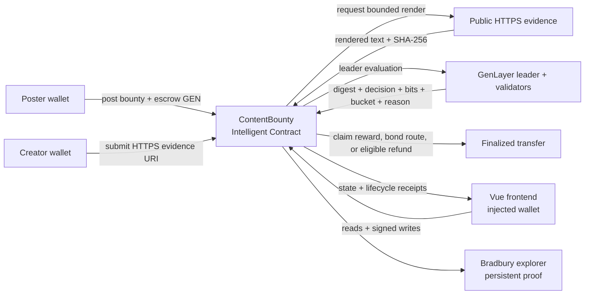

# ContentBounty

**Escrow for work that can prove itself.**

ContentBounty is a marketplace for creative work on the GenLayer Bradbury
testnet. A poster defines an ordered rubric and escrows a GEN reward. A creator
submits public evidence. GenLayer validators evaluate every required criterion,
while deterministic contract logic controls the verdict and settlement.

This is not an off-chain review dashboard. The contract records the bounty,
evidence commitment, submission lifecycle, consensus result, challenge state,
and deterministic settlement. An evaluation can approve a provisional result,
but only the explicit `claim_reward` path releases a creator reward after the
challenge window.

[](https://contentbounty.vercel.app)
[](https://github.com/unifyWeb3/contentbounty/actions/workflows/ci.yml)
[](https://docs.genlayer.com/)
[](https://vuejs.org/)
[](https://www.python.org/)
[](LICENSE)

## Historical live product

The public app, contract, proof, and fixture below are the deployed v2.1.1
system. The current v2.2 source in this repository has not been deployed and is
not runtime-compatible with that address.

| Surface | Link |
|---|---|
| Historical v2.1.1 product | https://contentbounty.vercel.app |
| Source | https://github.com/unifyWeb3/contentbounty |
| X walkthrough | [Watch on X](https://x.com/i/status/2087119821921993214) |
| YouTube demo | [Watch on YouTube](https://youtu.be/wv_5xmYamDU) |
| Historical v2.1.1 Bradbury contract | [`0x0d997CF8E3E8b4b7166ED2e0713F7F6927Ba4c04`](https://explorer-bradbury.genlayer.com/address/0x0d997CF8E3E8b4b7166ED2e0713F7F6927Ba4c04) |
| Historical deployment transaction | [`0x683451...4d93`](https://explorer-bradbury.genlayer.com/tx/0x6834512f8a6ad9bab36c9954477d9911617c6a097f6eaff33315bfddc8384d93) |
| Historical persistent proof | [Bradbury proof artifact](docs/proofs/bradbury-persistent-proof-v1.json) |
| Verification procedure | [Live consensus testing](docs/LIVE_CONSENSUS_TESTING.md) |
| Historical v2.1.1 evidence fixture | [Approval evidence](https://contentbounty-live-evidence.contentbounty.workers.dev/approve.txt) |

## How it works

| Operation | What happens on GenLayer Bradbury |
|---|---|
| `post_bounty(...)` | The poster funds a reward, defines deadlines, and commits an ordered rubric. |
| `submit_content(bounty_id, uri)` | Consensus renders an allowlisted HTTPS source, normalizes it, checks the creator's claim tag, and stores its SHA-256 commitment. |
| `evaluate_submission(submission_id)` | A leader evaluates the rubric and validators independently repeat the evidence pipeline. Approval becomes `APPROVED_PENDING`; no creator reward moves. |
| `challenge_submission(...)` | A non-creator challenger posts fixed-reason evidence with the exact challenge bond during the challenge window. The bounty poster may challenge. |
| `review_challenge(challenge_id)` | A second consensus round proposes `UPHOLD`, `DISMISS`, or `INCONCLUSIVE`; it never moves funds. |
| `finalize_challenge(...)` / `timeout_challenge(...)` | Deterministic logic settles a reviewed or timed-out challenge and routes its bond exactly once. |
| `claim_reward(submission_id)` | After the deadline and with no active challenge, the creator alone atomically finalizes the winner and receives the reward. |
| Rejected result | The submission is terminal and remains unpaid. |
| Inconclusive result | Fetch, parser, or digest uncertainty can be retried without misclassifying the creator. |
| `cancel_bounty(...)` | The poster can reclaim an untouched open bounty. |
| `expire_bounty(...)` | Anyone can trigger the refund after the evaluation deadline if no provisional winner or active challenge exists. |

Core equivalence rule:

```text
evidence SHA-256 + decision + criteria bits + score bucket + reason code + claim-tag state
```

Feedback is stored for users, but feedback wording never controls settlement.
The model does not choose the payment amount or recipient.

## GenLayer integrations

| Integration | Where it is used |
|---|---|
| Intelligent Contract on Bradbury | Escrow, bounty state, submissions, consensus results, transfers, and refunds. |
| `gl.nondet.web.render` | Retrieves bounded public evidence during submission and evaluation. |
| `gl.nondet.exec_prompt` | Extracts observations and judges every ordered rubric criterion. |
| `gl.vm.run_nondet_unsafe` | Runs the leader result against an independent validator policy. |
| `emit_transfer` | Releases a creator reward only from `claim_reward`, or returns an eligible refund/bond from deterministic paths. |
| `Keccak256` | Derives the domain-separated pre-submission claim tag; no ECDSA recovery primitive is assumed. |
| `gl.message_raw["datetime"]` | Supplies the authoritative transaction timestamp used for all deadlines. |
| Bradbury explorer | Provides public contract and transaction lifecycle evidence. |
| `genlayer-js` | Connects the Vue frontend to reads and externally signed wallet writes. |

## Verified Bradbury proof

| Scenario | On-chain result | Evidence |
|---|---|---|
| Bounty `#0`, submission `#0` | `REJECTED`, `CRITERIA_NOT_MET` | [Evaluation transaction](https://explorer-bradbury.genlayer.com/tx/0xd3d6cafc07bbe23725fc742dab66e6d43d0b7c2ba36c7d19082cb7ad5657df33) |
| Bounty `#4`, submission `#2` | `INCONCLUSIVE`, `DIGEST_MISMATCH` | [Evaluation transaction](https://explorer-bradbury.genlayer.com/tx/0x0708c8cb1c4f287292844b8e4f10ae27f4f45963176692d9031d8dbd3ef0b1aa) |
| Bounty `#5`, submission `#3` | `APPROVED`, `ALL_REQUIRED_CRITERIA_MET` | [Evaluation transaction](https://explorer-bradbury.genlayer.com/tx/0x5eca4c1ab3d15e7586aca3b32aabf035beba9917c310ad78da442b239ac1c227) |

Those links are historical proof artifacts for the previously deployed contract
version. They are not evidence that the current `contracts/content_bounty.py`
matches the live address, and they do not demonstrate the new delayed-claim
state machine. A fresh deployment and fresh proof must be generated after this
implementation is verified.

## Verification path

1. Open https://contentbounty.vercel.app and confirm the interface identifies
   GenLayer Bradbury.
2. Open the deployed contract from the live product table.
3. Inspect bounty `#0` for the clear rejection result.
4. Inspect bounty `#4` for the changed-evidence `DIGEST_MISMATCH` result.
5. Treat bounty `#5` as historical evidence only; the current implementation
   requires `APPROVED_PENDING`, a challenge window, and a separate claim.
6. Compare the public app state with the three explorer transactions above.
7. Run `npm run verify:live-proof:online` for a read-only lifecycle check.

## Product screens


The interface deliberately separates an approved on-chain result from payout
confirmation observed by the current browser. The persistent balance proof is
linked above and is independently checked against the finalized recipient delta.

## Architecture


```mermaid
flowchart LR
    P[Poster wallet] -->|post bounty + escrow GEN| C[ContentBounty<br/>Intelligent Contract]
    R[Creator wallet] -->|submit HTTPS evidence URI| C
    C -->|request bounded render| E[Public HTTPS evidence]
    E -->|rendered text + SHA-256| C
    C -->|leader evaluation| V[GenLayer leader + validators]
    V -->|digest + decision + bits + bucket + reason| C
   C -->|claim reward, bond route, or eligible refund| T[Finalized transfer]
    F[Vue frontend<br/>injected wallet] -->|reads + signed writes| C
    C -->|state + lifecycle receipts| F
    C --> X[Bradbury explorer<br/>persistent proof]
```

No custodial backend, private judge, or frontend-held signing key controls the
outcome. The Intelligent Contract is the source of truth.

## Lifecycle

| Bounty status | Meaning |
|---|---|
| `OPEN` | Funded with no provisional or final winner. It may be untouched, or reopened after an upheld challenge; submission and cancellation eligibility still follow the stored deadlines and counts. |
| `LOCKED` | At least one submission remains evaluable, or a provisional winner is awaiting settlement. Poster cancellation is disabled. |
| `FILLED` | A consensus-approved submission won and the reward was emitted. |
| `CANCELLED` | An untouched bounty was refunded to its poster. |
| `EXPIRED` | The deadline passed without a winner and the poster was refunded. |

Submissions move through `PENDING`, `APPROVED_PENDING`, `APPROVED`, `REJECTED`,
`INCONCLUSIVE`, and `SUPERSEDED`. `APPROVED_PENDING` means the consensus
evaluation passed, but the reward is still escrowed during the challenge window.
Only `claim_reward` changes it to final `APPROVED`. Challenges use exactly
`OPEN`, `UPHELD`, `DISMISSED`, and `TIMED_OUT`; `active_challenge_id=0` means
there is no active challenge. Inconclusive evaluations and challenge reviews
can retry only within their bounded attempt/deadline rules.

## Repository layout

```text
contracts/                  GenLayer Intelligent Contract
frontend/                   Vue product with injected wallet signing
hosting/live-evidence/      Public canonical evidence Worker
scripts/                    Deployment, proof, recovery, and safety tools
tests/direct/               GenLayer Direct Mode contract tests
tests/js/                   Lifecycle, proof, network, and recovery tests
tests/unit/                 Evidence preparation tests
docs/assets/                Product screenshots
docs/proofs/                Sanitized persistent Bradbury proof
```

## Run locally

Requirements: Node.js 22, npm, and Python 3.12.

```bash
git clone https://github.com/unifyWeb3/contentbounty.git
cd contentbounty
npm ci
npm ci --prefix frontend
cp frontend/.env.example frontend/.env
npm --prefix frontend run dev
```

Production build against the tracked historical configuration:

```bash
VITE_GENLAYER_NETWORK=testnetBradbury VITE_CONTRACT_ADDRESS=0x0d997CF8E3E8b4b7166ED2e0713F7F6927Ba4c04 npm run build:frontend
npm run verify:frontend-bundle
```

The production build fails closed if required network or address configuration
is missing or malformed. The tracked address is the historical v2.1.1
deployment, so a successful bundle does not establish v2.2 runtime
compatibility. A later v2.2 deployment and environment update are required.

## Prepare evidence

Evidence must be UTF-8 raw text at a stable HTTPS URI. After line-ending and
outer-whitespace normalization, it must contain 1 to 16,000 characters.

```bash
.venv/bin/python scripts/prepare_evidence.py --uri https://raw.githubusercontent.com/owner/repository/main/evidence.txt --file evidence.txt --write-canonical canonical-evidence.txt
```

Submission consensus remains authoritative and stores the renderer-derived
digest. Before publishing, the creator must place the displayed claim tag in the
source. A later content change becomes `DIGEST_MISMATCH`; removing the tag is a
deterministic `CLAIM_TAG_MISSING` rejection before any LLM evaluation.

## Consensus security and provenance

### Claim tag

For a selected bounty and wallet, the pure `get_claim_tag(bounty_id,
creator_address)` view derives a readable token from a domain separator, version,
chain ID, contract address, bounty ID, and creator address. The current runtime
provides an Ethereum-compatible `Keccak256`, so the contract uses an 80-bit
hexadecimal prefix in the form `cb-<20 hex characters>`. The frontend obtains
the same canonical value from the view before publication and offers a copy
action. Eighty bits keeps the birthday-collision probability around 4e-13 even
across one million tags, while keeping the token short enough to place in a
post.

The tag is a practical control signal: if the exact token is present in the
normalized rendered source, the submitting wallet had sufficient control of the
publishing surface to place it at render time. The deterministic check is
case-insensitive and requires token boundaries. It is performed by consensus
before submission state is allocated and again before any evaluation prompt.

The tag does not prove legal authorship, copyright ownership, the real-world
identity behind a wallet, originality, truthfulness of claims, or permanent
control of a source. It is not a legal or cryptographic authorship attestation.
Platforms where a post cannot be edited must receive the tag before publication;
an omitted tag cannot be repaired by this implementation. There is no
post-publication or same-submission repair path in this scope.

### Supported source surfaces

The deterministic source policy accepts only `github.com`,
`raw.githubusercontent.com`, `gist.github.com`, `mirror.xyz`, `hackmd.io`,
`medium.com`, and `substack.com` plus valid Substack subdomains. URLs must be
canonical HTTPS, contain no credentials or fragments, and use an exact allowed
host. The allowlist constrains sources the GenVM renderer is prepared to handle;
it is not proof of ownership or authorship. X/Twitter is intentionally excluded
until a reliable, deterministic renderer path is established.

### Challenges and delayed settlement

An approval enters `APPROVED_PENDING` and records a 48-hour challenge deadline;
the bounty remains `LOCKED`, no competitor is superseded, and no creator reward
is transferred. A challenge uses one fixed reason code:

`NO_SOURCE_CONTROL`, `AUTHORSHIP_DISPUTE`, `RIGHTS_OR_PLAGIARISM`,
`FALSE_OR_MISLEADING_CLAIM`, `SOURCE_TAMPERED`, or
`RUBRIC_EVALUATION_ERROR`.

The exact integer bond is:

```text
max(reward * 500 / 10000, 0.0001 GEN)
```

The submission creator cannot challenge their own submission; the bounty poster
may challenge because the poster is an economically interested party who still
needs a permissionless way to dispute an incorrect approval. An upheld or timed-
out challenge returns the bond to the challenger and rejects only an upheld
submission. A dismissed challenge pays the bond to the submission creator as
compensation for a frivolous challenge, while leaving the approved result
claimable after the original deadline. Every bond is marked and released exactly
once.

`review_challenge` is a nondeterministic proposal round. It independently
renders and commits both sources, checks the stored digest and claim tag, and
only then uses bounded prompts with source text framed as untrusted data.
`finalize_challenge` is a separate deterministic settlement round; review output
cannot itself move funds. Leader/validator disagreement reverts without a
proposal or bond movement. Feedback wording is excluded from equivalence.

Challenge review can time out either after three agreed inconclusive attempts or
after 48 hours from challenge creation. The elapsed-time path is mandatory so a
validator disagreement cannot lock escrow forever. Timeout intentionally fails
open to the already consensus-approved result: the challenge bond returns to the
challenger, the active challenge clears, and the creator may claim once the
original challenge deadline has elapsed.

`claim_reward` is the sole creator-reward path. It checks the creator caller,
deadline, active challenge, provisional winner, bounty lock, and one-time claim,
updates all settlement fields before emitting the finalized transfer, marks the
bounty `FILLED`, and supersedes remaining pending competitors.

### Deferred identity work

This implementation deliberately does not include a wallet-to-platform handle
registry, registration proofs, source generations, reverse indexes, or a signed
identity attestation. The claim tag and allowlist establish practical source
control evidence only. A future registry can add authoritative platform/handle
binding after its platform-specific proof model and deterministic renderer
requirements are specified.

## Test and verify

```bash
python3 -m venv .venv
.venv/bin/pip install -r requirements.txt
npm run lint:contract
npm run check:contract
npm run test:contract
npm run test:evidence
npm run test:network
npm run test:lifecycle
npm run test:hosting
npm --prefix frontend test
npm run build:frontend
npm run verify:live-proof
```

Online proof verification is separate and read-only:

```bash
npm run verify:live-proof:online
```

## Security and limitations

- The frontend uses an injected wallet and never requests or stores a private
  key.
- Before every write, the frontend verifies Bradbury execution state and the
  configured consensus contract identity.
- An accepted transaction is never presented as finalized.
- Payout confirmation requires a finalized `claim_reward` execution and a
  recipient balance delta; an evaluation approval alone is never payment.
- A missing claim tag is a deterministic rejection with no LLM call; changed or
  otherwise unverifiable evidence remains an `INCONCLUSIVE` path where the
  contract cannot make a deterministic claim-tag decision.
- The challenge mechanism disputes plagiarism, rights, false claims, source
  control, or evaluation error; it does not turn an LLM judgment into legal
  adjudication.
- Bradbury is a public testnet. Tests and persistent proof do not replace a
  formal security audit.
- Bradbury shares chain ID `4221` with another GenLayer network. Wallets that
  cannot switch automatically must use the Bradbury RPC configuration.

## Deployment status

The checked-in Bradbury proof is real historical v2.1.1 evidence: its three
scenarios finalized on-chain and its payout proof records a persistent testnet
balance delta rather than a simulated balance. The current v2.2 contract and
frontend method surface are not deployed. The tracked frontend address still
points to v2.1.1 and must not be presented as runtime-compatible with this
source until a later deployment, environment update, and proof regeneration.

## Documentation

- [ContentBounty v2 specification](docs/CONTENT_BOUNTY_V2_SPEC.md)
- [Live consensus testing and recovery](docs/LIVE_CONSENSUS_TESTING.md)
- [Persistent Bradbury proof](docs/proofs/bradbury-persistent-proof-v1.json)
- [Frontend safety model](frontend/README.md)
- [Historical v2.1.1 Evidence Worker](hosting/live-evidence/README.md)
- [Historical implementation log through v2.1.1](IMPLEMENTATION_LOG.md)

`AUDIT_REPORT.md` covers the historical pre-v2 commit and is not a report on the
current verified deployment.

## License

[MIT](LICENSE) Copyright 2026 unifyWeb3
