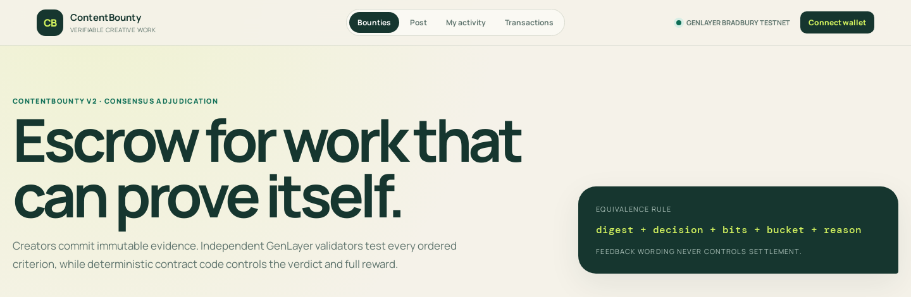
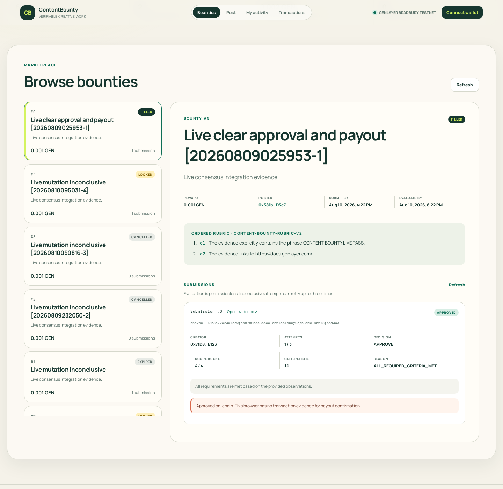
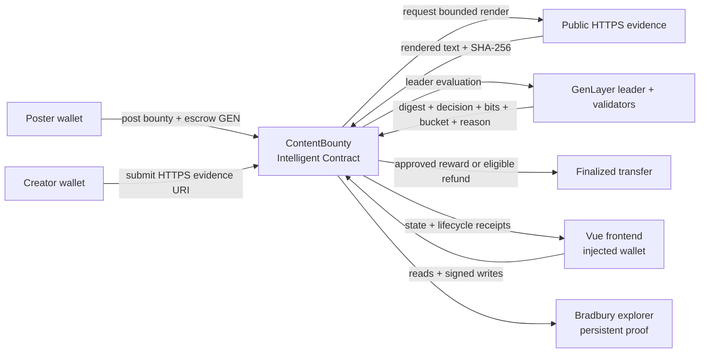

# ContentBounty

**Escrow for work that can prove itself.**

ContentBounty is a marketplace for creative work on the GenLayer Bradbury
testnet. A poster defines an ordered rubric and escrows a GEN reward. A creator
submits public evidence. GenLayer validators evaluate every required criterion,
while deterministic contract logic controls the verdict and settlement.

This is not an off-chain review dashboard. The contract records the bounty,
evidence commitment, submission lifecycle, and consensus result, then executes
the settlement transfer. The public proof links rejection, changed evidence,
approval, and an exact reward balance delta to finalized Bradbury transactions.

[](https://contentbounty.vercel.app)
[](https://github.com/unifyWeb3/contentbounty/actions/workflows/ci.yml)
[](https://docs.genlayer.com/)
[](https://vuejs.org/)
[](https://www.python.org/)
[](LICENSE)

## Live product

| Surface | Link |
|---|---|
| Product | https://contentbounty.vercel.app |
| Source | https://github.com/unifyWeb3/contentbounty |
| X walkthrough | [Watch on X](https://x.com/i/status/2087119821921993214) |
| YouTube demo | [Watch on YouTube](https://youtu.be/wv_5xmYamDU) |
| Bradbury contract | [`0x0d997CF8E3E8b4b7166ED2e0713F7F6927Ba4c04`](https://explorer-bradbury.genlayer.com/address/0x0d997CF8E3E8b4b7166ED2e0713F7F6927Ba4c04) |
| Deployment transaction | [`0x683451...4d93`](https://explorer-bradbury.genlayer.com/tx/0x6834512f8a6ad9bab36c9954477d9911617c6a097f6eaff33315bfddc8384d93) |
| Persistent proof | [Bradbury proof artifact](docs/proofs/bradbury-persistent-proof-v1.json) |
| Verification procedure | [Live consensus testing](docs/LIVE_CONSENSUS_TESTING.md) |
| Public evidence fixture | [Approval evidence](https://contentbounty-live-evidence.contentbounty.workers.dev/approve.txt) |

## How it works

| Operation | What happens on GenLayer Bradbury |
|---|---|
| `post_bounty(...)` | The poster funds a reward, defines deadlines, and commits an ordered rubric. |
| `submit_content(bounty_id, uri)` | Consensus renders canonical HTTPS evidence, normalizes it, and stores its SHA-256 commitment. |
| `evaluate_submission(submission_id)` | A leader evaluates the rubric and validators independently repeat the evidence pipeline. |
| Approved result | The contract marks the winner, supersedes open competitors, and emits the full reward transfer. |
| Rejected result | The submission is terminal and remains unpaid. |
| Inconclusive result | Fetch, parser, or digest uncertainty can be retried without misclassifying the creator. |
| `cancel_bounty(...)` | The poster can reclaim an untouched open bounty. |
| `expire_bounty(...)` | Anyone can trigger the refund after the evaluation deadline if no winner exists. |

Core equivalence rule:

```text
evidence SHA-256 + decision + criteria bits + score bucket + reason code
```

Feedback is stored for users, but feedback wording never controls settlement.
The model does not choose the payment amount or recipient.

## GenLayer integrations

| Integration | Where it is used |
|---|---|
| Intelligent Contract on Bradbury | Escrow, bounty state, submissions, consensus results, transfers, and refunds. |
| `gl.nondet.web.render` | Retrieves bounded public evidence during submission and evaluation. |
| `gl.nondet.exec_prompt` | Extracts observations and judges every ordered rubric criterion. |
| `gl.vm.run_nondet_unsafe` | Runs the leader result against an independent validator policy. |
| `emit_transfer` | Releases an approved reward or returns an eligible refund. |
| Bradbury explorer | Provides public contract and transaction lifecycle evidence. |
| `genlayer-js` | Connects the Vue frontend to reads and externally signed wallet writes. |

## Verified Bradbury proof

| Scenario | On-chain result | Evidence |
|---|---|---|
| Bounty `#0`, submission `#0` | `REJECTED`, `CRITERIA_NOT_MET` | [Evaluation transaction](https://explorer-bradbury.genlayer.com/tx/0xd3d6cafc07bbe23725fc742dab66e6d43d0b7c2ba36c7d19082cb7ad5657df33) |
| Bounty `#4`, submission `#2` | `INCONCLUSIVE`, `DIGEST_MISMATCH` | [Evaluation transaction](https://explorer-bradbury.genlayer.com/tx/0x0708c8cb1c4f287292844b8e4f10ae27f4f45963176692d9031d8dbd3ef0b1aa) |
| Bounty `#5`, submission `#3` | `APPROVED`, `ALL_REQUIRED_CRITERIA_MET` | [Evaluation transaction](https://explorer-bradbury.genlayer.com/tx/0x5eca4c1ab3d15e7586aca3b32aabf035beba9917c310ad78da442b239ac1c227) |

The approval proof records a finalized recipient balance increase of
`1000000000000000` wei, exactly equal to the `0.001 GEN` reward. Public proof
flags report `proofComplete=true` and `persistentPayoutProofValid=true`.
Balances were not simulated.

## Verification path

1. Open https://contentbounty.vercel.app and confirm the interface identifies
   GenLayer Bradbury.
2. Open the deployed contract from the live product table.
3. Inspect bounty `#0` for the clear rejection result.
4. Inspect bounty `#4` for the changed-evidence `DIGEST_MISMATCH` result.
5. Inspect bounty `#5` for the approved submission and filled bounty.
6. Compare the public app state with the three explorer transactions above.
7. Run `npm run verify:live-proof:online` for a read-only lifecycle check.

## Product screens





The interface deliberately separates an approved on-chain result from payout
confirmation observed by the current browser. The persistent balance proof is
linked above and is independently checked against the finalized recipient delta.

## Architecture


```mermaid
flowchart LR
    P[Poster wallet] -->|post bounty + escrow GEN| C[ContentBounty<br/>Intelligent Contract]
    R[Creator wallet] -->|submit HTTPS evidence URI| C
    C -->|request bounded render| E[Public HTTPS evidence]
    E -->|rendered text + SHA-256| C
    C -->|leader evaluation| V[GenLayer leader + validators]
    V -->|digest + decision + bits + bucket + reason| C
    C -->|approved reward or eligible refund| T[Finalized transfer]
    F[Vue frontend<br/>injected wallet] -->|reads + signed writes| C
    C -->|state + lifecycle receipts| F
    C --> X[Bradbury explorer<br/>persistent proof]
```

No custodial backend, private judge, or frontend-held signing key controls the
outcome. The Intelligent Contract is the source of truth.

## Lifecycle

| Bounty status | Meaning |
|---|---|
| `OPEN` | Funded and accepting submissions. The untouched bounty can still be cancelled. |
| `LOCKED` | At least one creator submitted. Poster cancellation is disabled. |
| `FILLED` | A consensus-approved submission won and the reward was emitted. |
| `CANCELLED` | An untouched bounty was refunded to its poster. |
| `EXPIRED` | The deadline passed without a winner and the poster was refunded. |

Submissions become `APPROVED`, `REJECTED`, `INCONCLUSIVE`, or `SUPERSEDED`.
Inconclusive evaluations can retry up to three times.

## Repository layout

```text
contracts/                  GenLayer Intelligent Contract
frontend/                   Vue product with injected wallet signing
hosting/live-evidence/      Public canonical evidence Worker
scripts/                    Deployment, proof, recovery, and safety tools
tests/direct/               GenLayer Direct Mode contract tests
tests/js/                   Lifecycle, proof, network, and recovery tests
tests/unit/                 Evidence preparation tests
docs/assets/                Product screenshots
docs/proofs/                Sanitized persistent Bradbury proof
```

## Run locally

Requirements: Node.js 22, npm, and Python 3.12.

```bash
git clone https://github.com/unifyWeb3/contentbounty.git
cd contentbounty
npm ci
npm ci --prefix frontend
cp frontend/.env.example frontend/.env
npm --prefix frontend run dev
```

Production build:

```bash
VITE_GENLAYER_NETWORK=testnetBradbury VITE_CONTRACT_ADDRESS=0x0d997CF8E3E8b4b7166ED2e0713F7F6927Ba4c04 npm run build:frontend
npm run verify:frontend-bundle
```

The production build fails closed if the network or contract configuration is
missing, historical, or incompatible.

## Prepare evidence

Evidence must be UTF-8 raw text at a stable HTTPS URI. After line-ending and
outer-whitespace normalization, it must contain 1 to 16,000 characters.

```bash
.venv/bin/python scripts/prepare_evidence.py --uri https://gateway.example/ipfs/<cid>/evidence.txt --file evidence.txt --write-canonical canonical-evidence.txt
```

Submission consensus remains authoritative and stores the renderer-derived
digest. A later content change becomes `DIGEST_MISMATCH`.

## Test and verify

```bash
python3 -m venv .venv
.venv/bin/pip install -r requirements.txt
npm run lint:contract
npm run check:contract
npm run test:contract
npm run test:evidence
npm run test:network
npm run test:lifecycle
npm run test:hosting
npm --prefix frontend test
npm run build:frontend
npm run verify:live-proof
```

Online proof verification is separate and read-only:

```bash
npm run verify:live-proof:online
```

## Security and limitations

- The frontend uses an injected wallet and never requests or stores a private
  key.
- Before every write, the frontend verifies Bradbury execution state and the
  configured consensus contract identity.
- An accepted transaction is never presented as finalized.
- Payout confirmation requires finalized execution and a recipient balance
  delta.
- Changed or unverifiable evidence fails toward `INCONCLUSIVE`, not a dishonest
  rejection.
- Bradbury is a public testnet. Tests and persistent proof do not replace a
  formal security audit.
- Bradbury shares chain ID `4221` with another GenLayer network. Wallets that
  cannot switch automatically must use the Bradbury RPC configuration.

## What is real

Everything in the shipped product path is real: the public frontend reads the
deployed Bradbury contract, the evidence fixtures are publicly retrievable, the
three proof scenarios were finalized on-chain, and the payout proof uses a real
persistent testnet balance delta. No production proof balance was mocked or
simulated.

## Documentation

- [ContentBounty v2 specification](docs/CONTENT_BOUNTY_V2_SPEC.md)
- [Live consensus testing and recovery](docs/LIVE_CONSENSUS_TESTING.md)
- [Persistent Bradbury proof](docs/proofs/bradbury-persistent-proof-v1.json)
- [Frontend safety model](frontend/README.md)
- [Evidence Worker](hosting/live-evidence/README.md)
- [Implementation log](IMPLEMENTATION_LOG.md)

`AUDIT_REPORT.md` covers the historical pre-v2 commit and is not a report on the
current verified deployment.

## License

[MIT](LICENSE) Copyright 2026 unifyWeb3
